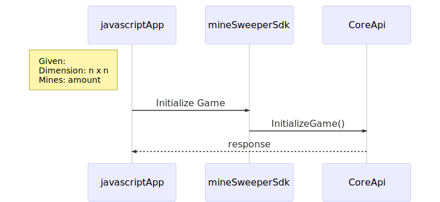

# minesweeper-api
The minesweeper api provides the core services to build the game in different platforms.

### Architecture Minesweeper Game



### API Docs

You can download the postman api collection <a href="./docs/postman/minesweeper.postman_collection.json" download>postman download</a>

#### Create A Game API

```
POST http://ec2-54-175-170-14.compute-1.amazonaws.com:8080/games
```
**Payload:**
```json
{
	"dimension": 10,
	"number_of_bomb": 4 
}
```
curl
```
curl -X POST \
  http://ec2-54-175-170-14.compute-1.amazonaws.com:8080/games \
  -H 'Content-Type: application/json' \
  -d '{
	"dimension": 10,
	"number_of_bomb": 4 
}'
```

### Play one turn API

```
POST http://ec2-54-175-170-14.compute-1.amazonaws.com:8080/games/{idGame}/play
```
**Payload:**
```json
{
	"dimension": 10,
	"number_of_bomb": 4 
}
```
curl
```
curl -X POST \
  http://ec2-54-175-170-14.compute-1.amazonaws.com:8080/games/{idGame}/play \
  -H 'Content-Type: application/json' \
  -d '{
	"row": 0,
	"column": 4 
}'
```


