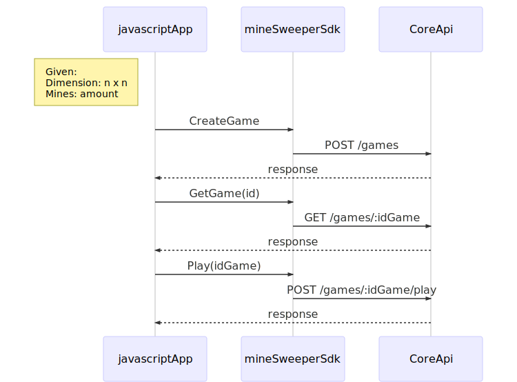

# minesweeper-api
The minesweeper api provides the core services to build the game in different platforms.

### Architecture Minesweeper Game



### API Docs

You can download the postman api collection <a href="./docs/postman/minesweeper.postman_collection.json" download>postman download</a>

#### Create A Game API

```
POST http://ec2-54-175-170-14.compute-1.amazonaws.com:8080/games
```
**Payload:**
```json
{
	"dimension": 10,
	"number_of_bomb": 4 
}
```
curl
```
curl -X POST \
  http://ec2-54-175-170-14.compute-1.amazonaws.com:8080/games \
  -H 'Content-Type: application/json' \
  -d '{
	"dimension": 10,
	"number_of_bomb": 4 
}'
```

### Play one turn API

```
POST http://ec2-54-175-170-14.compute-1.amazonaws.com:8080/games/{idGame}/play
```
**Payload:**
```json
{
	"dimension": 10,
	"number_of_bomb": 4 
}
```
curl
```
curl -X POST \
  http://ec2-54-175-170-14.compute-1.amazonaws.com:8080/games/{idGame}/play \
  -H 'Content-Type: application/json' \
  -d '{
	"row": 0,
	"column": 4 
}'
```

### Get Started

Let's clone this project in your local enviromnent
```
#run this command to create if the directory does not exist.
mkdir -p $GOPATH/github.com/deviget

cd $GOPATH/github.com/deviget

git clone https://github.com/alexrv11/minesweeper-api.git

cd minesweeper-api


```
1. Running using `docker-compose. if you need have installed docker and docker compose. See <a href="https://docs.docker.com/install/" _blank>docker install</a> and <a href="https://docs.docker.com/compose/install/" _blank>docker compose</a>

```
  docker-compose build
  docker-compose up

  #The app is running on localhost:8080

```

2. Running using command line

```
#Go inside the project minesweeper-api/src
go run main.go
```


